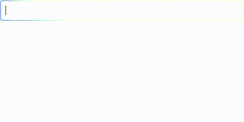

# gtkrun
This program launches applications in a graphical environment supported by GTK4. It is similar to [gRun](https://github.com/lrgc/grun) but uses GTK4.

## Using
### Run
Just run `gtkrun` when you are in X or Wayland (not tested). You can add some options, `gtkrun --help` will show them.

At start the program reads the history file (if `--no-history` is not set) and the environment variable `$PATH` for binary directories. It creates the history file (`$XDG_CACHE_HOME/gtkrun/history` or `$HOME/.cache/gtkrun/history`) containing the list of recently executed commands. It is a simple text file, you can modify it freely.

### Dialog
Start typing and the program will complete your command:


Press `[Tab]` button to see the list of all completions:



Next just press `[Enter]` to execute command: either from the entry or from the list.
Press `[Esc]` or `[Ctrl-q]` to terminate the program.

### Custom config
You may create the textual configure file `$XDG_CONFIG_HOME/gtkrun/config` (or `$HOME/.config/gtkrun/config`), that will be scanned at the program start, or set `no-config` argument to ignore the configure file. Arguments added to the program will overwrite appropriate configure lines.

Custom config example:

	[Main]
	silent = false
	width = 400
	height = 200
	max_height = 200
	history-path = /path/to/history/file
	no-history = false

## Build and install

Build-time dependencies:

1. gcc or clang
2. [cmake](https://gitlab.kitware.com/cmake/cmake)

Run-time dependencies:

1. [glib](https://gitlab.gnome.org/GNOME/glib)
2. [gtk4](https://gitlab.gnome.org/GNOME/gtk)


To build:

```
cmake -S gtkrun -B /tmp/gtkrun/release -DCMAKE_BUILD_TYPE=Release -DCMAKE_INSTALL_PREFIX=/usr -DCMAKE_TOOLCHAIN_FILE=GlibToolChain.cmake
```

To install:

```
DESTDIR=$HOME/.local cmake --build /tmp/gtkrun/release --config Release --target install
```
